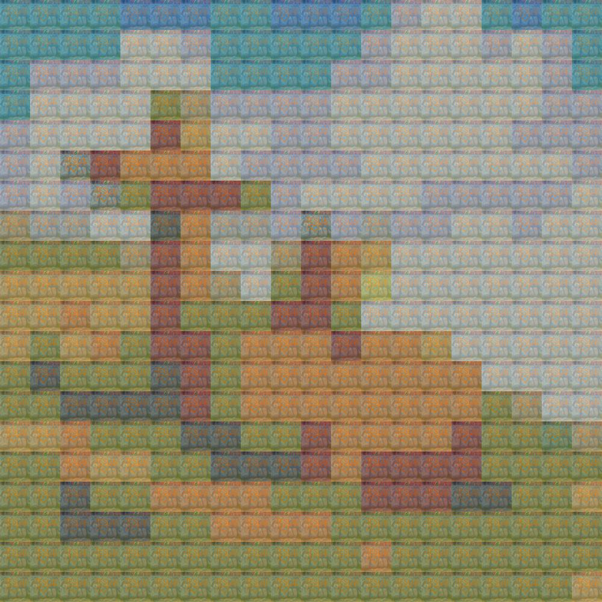
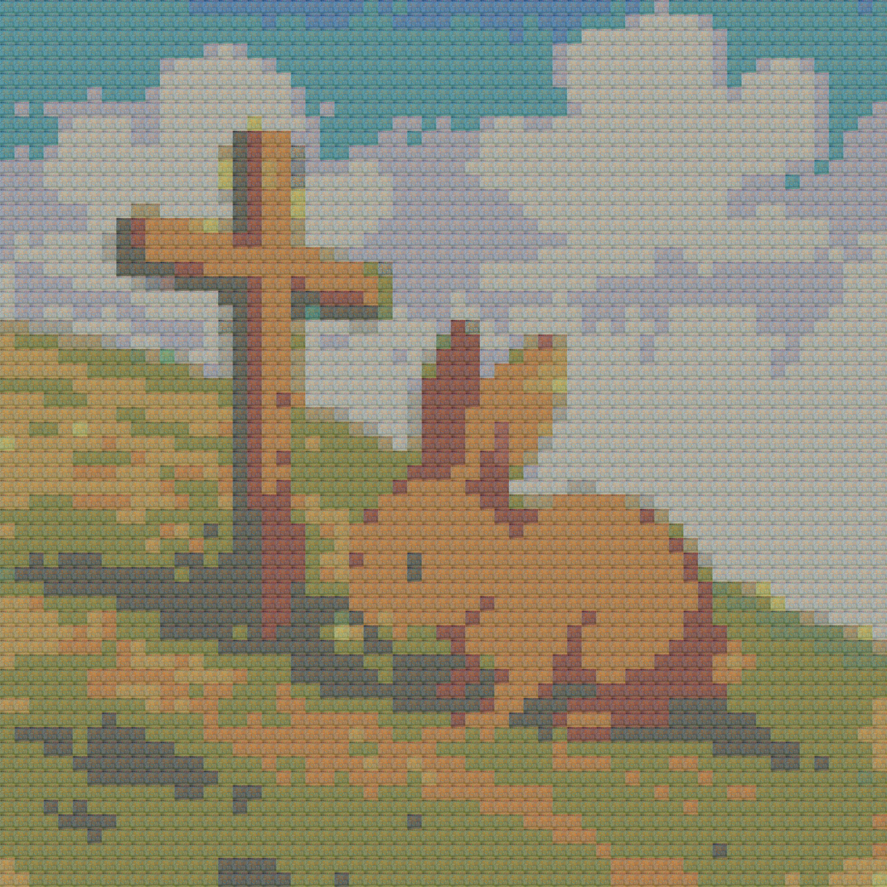

# mosaic-image-generator

This README provides instructions for using a set of Python scripts to generate photo mosaics, detailing how to prepare input tiles, adjust their colors, configure parameters like the base image and tile density via `user_config.ini`, and run the scripts to create the final mosaic image.

## LLM Code Generation Notice

Portions of this codebase were generated or refined using large language models (LLMs) including models such as Gemini, ChatGPT, Claude, DeepSeek, Qwen, Dolphin-Llama, and more, integrated API Plugins Such as Cline, Continue, Roo Code, and more, and Service Providers such as OpenRouter, Ollama, HuggingFace, Cursor, and GitHub Copilot and more. Final code was reviewed and adapted by the project maintainer. Use at your own risk.

# Limitation of Liability Statement

For a complete Limitation of Liability Statement, please visit my [website](https://cruzgmacias-cv.w3spaces.com/).


# Photo Mosaic Generator

This project generates mosaics using source tiles matched against a base image. Demonstration below:

Sample Mosaic Result with a GRID_RESOLUTION_FACTOR = 7.0

My wife and I shown in the mosaic below using 9 photos of us as tiles.


The tile source can include stylistic elements. For example:


Sample Base Image


Sample Mosaic Results with different GRID_RESOLUTION_FACTOR values:

GRID_RESOLUTION_FACTOR = 1.0



GRID_RESOLUTION_FACTOR = 3.0


GRID_RESOLUTION_FACTOR = 5.0


GRID_RESOLUTION_FACTOR = 10.0


This project provides a set of Python scripts to generate photo mosaics. It involves two main stages: preparing a library of color-adjusted tile images from an input set, and then using that library to construct a mosaic resembling a target base image.

## Prerequisites

Ensure you have Python 3 installed. Using a virtual environment is strongly recommended to manage project dependencies and avoid conflicts with system-wide packages.

### Python Virtual Environment Setup (Recommended)

A virtual environment creates an isolated sandbox for your Python project, ensuring that dependencies installed for this project do not interfere with other projects or your global Python installation.

1.  **Create the Virtual Environment:**
    Open your terminal or command prompt, navigate to the project's root directory, and run:
    ```bash
    python -m venv venv
    ```
    (You can replace `venv` with your preferred environment name, e.g., `env`). This creates a `venv/` subdirectory containing a copy of Python and `pip`.

2.  **Activate the Virtual Environment:**
    *   **Windows (Command Prompt/PowerShell):**
        ```cmd
        env\Scripts\activate.bat
        ```
        (If using Git Bash or similar on Windows, the source command might be needed: `source venv/Scripts/activate`)
    *   **macOS/Linux (Bash/Zsh):**
        ```bash
        source env/bin/activate
        ```
    Your terminal prompt should change to indicate the active environment (e.g., `(venv) C:\path\to\project>`).

3.  **Verify Activation (Optional):**
    You can confirm Python commands now run from the virtual environment's path:
    *   **Windows:**
        ```cmd
        where python
        ```
    *   **macOS/Linux:**
        ```bash
        which python
        ```
    The output should point to the Python executable inside your `venv` directory.

### Installing Dependencies

Once your virtual environment is activated, you can install the required libraries.

*   **Using `requirements.txt` (Recommended):**
    This project includes a `requirements.txt` file listing the necessary dependencies. Install them all with:
    ```bash
    pip install -r requirements.txt
    ```
    The required libraries are:
    *   `Pillow`: For image loading, manipulation, and saving.
    *   `numpy`: For efficient numerical operations, especially on image data arrays.
    *   `scipy`: Used for its `KDTree` implementation, enabling fast nearest-neighbor searches for color matching.

*   **Manual Installation & Generating `requirements.txt` (If starting fresh):**
    If `requirements.txt` did not exist, you would install packages individually:
    ```bash
    pip install Pillow numpy scipy
    ```
    After installing, you can generate the `requirements.txt` file to lock down the dependencies and their versions for reproducibility:
    ```bash
    pip freeze > requirements.txt
    ```

4.  **Deactivating the Environment:**
    When you are finished working on the project, simply run:
    ```bash
    deactivate
    ```

### Why Use a Virtual Environment?

*   **Isolation:** Prevents dependency conflicts between projects. Project A can use version 1.0 of a library while Project B uses version 2.0 without issue.
*   **Reproducibility:** `requirements.txt` ensures that anyone setting up the project uses the same dependency versions, leading to more consistent behavior.
*   **Cleanliness:** Keeps your global Python installation tidy and free from project-specific packages.

## Directory Structure

The scripts expect the following directory structure in the project root:

-   `tiles_input/`: Place your original tile images here.
-   `tiles_output/`: Intermediate directory where adjusted tiles are generated. (Created automatically, can be cleaned up).
-   `tiles_archive/`: Directory where archives of *previous* `tiles_output` contents are stored (if opted for). Also created automatically.
-   `mosaic_results/`: Final mosaic images are saved here. (Created automatically).
-   `user_config.ini`: Configuration file for mosaic generation parameters.
-   `base_image.png` (or `.jpg`, etc.): Your target base image should ideally be placed here or its path specified in `user_config.ini`.

## Usage Instructions

Follow these steps to generate a photo mosaic:

### Step 1: Prepare Input Tile Images

1.  Gather the images you want to use as tiles for the mosaic.
2.  Place these images into the `tiles_input` directory.
3.  Supported image formats include: `.png`, `.jpg`, `.jpeg`, `.bmp`, `.gif`, `.tiff`.

### Step 2: Adjust Tile Colors & Create Tile Archive

This step creates multiple color variations of each input tile image, which are essential for matching colors in the base image. Several scripts are provided for this, offering different palettes and adjustment methods.

1.  **Choose an Adjustment Script:**
    *   `adjustTilesBasic6Colors.py`: Uses grayscale conversion and colorization to tint images towards a basic 6-color palette (+ magenta).
    *   `adjustTilesGradient6Colors.py`: Blends input images with a versatile 6-color palette using a configurable blend alpha.
    *   `adjustTilesGradient12Colors.py`: Blends input images with a 12-color palette.
    *   `adjustTilesGradient24Colors.py`: Blends input images with an extensive 24-color palette for finer color gradations.
2.  **Run the Chosen Script:** Execute one of the scripts from your terminal (ensure you are in the project's root directory):
    ```bash
    # Example using the 24-color gradient script
    python adjustTilesGradient24Colors.py
    ```
3.  **Script Operation:**
    *   The script first checks the `tiles_input` directory for images.
    *   It then checks the `tiles_output` directory.
        *   **Archiving Existing Output:** If `tiles_output` contains files from a previous run, the script will prompt you:
            1.  Whether to remove the existing files (`Y/N`). You must choose 'Y' to proceed with generating new tiles.
            2.  If 'Y' is chosen for removal, it will ask if you want to archive the *current* contents of `tiles_output` before removal (`Y/N`).
            3.  If archiving is chosen ('Y'), and the number of files/estimated size is large (e.g., > 200 files), it will display a warning about potential time and disk space usage and ask for final confirmation (`Y/N`).
            4.  If confirmed, a timestamped `.zip` archive (e.g., `tiles_output_archive_20231027_103000.zip`) of the *old* content is created in the `tiles_archive` directory before `tiles_output` is cleared.
    *   For each image in `tiles_input`:
        *   A copy of the original is placed in `tiles_output`.
        *   Color-adjusted versions (based on the script's palette) are generated and saved to `tiles_output` (e.g., `my_image_WarmRed_Vermilion.png`).
    *   **Final Archive:** After processing all input images, the script creates a final archive named `tiles_archive.zip` in the project root directory. This archive contains *all* the newly generated files currently in the `tiles_output` directory (originals + color variants). This `tiles_archive.zip` is the input source for the mosaic generation step.

4.  **Output Tile Count & Size Warning:**
    *   Be aware that the number of images generated in `tiles_output` (and thus in `tiles_archive.zip`) is calculated as: `(Number of Colors in Palette + 1) * Number of Input Images`.
    *   **Example 1 (Small Set):** 10 input images using `adjustTilesGradient24Colors.py` (24 colors) will result in `(24 + 1) * 10 = 250` images in `tiles_output` and `tiles_archive.zip`.
    *   **Example 2 (Large Set):** 100 input images using `adjustTilesGradient24Colors.py` will result in `(24 + 1) * 100 = 2500` images.
    *   Processing a large number of input images can lead to a very large `tiles_archive.zip` file and significantly increase processing time for both adjustment and mosaic generation steps. The script's built-in warning mechanism during the *archiving* of previous outputs helps manage expectations regarding disk space for backups.

### Step 3: Prepare the Base Image

1.  Choose the image you want the final mosaic to resemble. This is the "base" image.
2.  Place this image in the project's root directory (e.g., `base_image.png`) or note its path.
3.  Supported formats include `.png`, `.jpg`, `.jpeg`, etc.

### Step 4: Configure Mosaic Generation (`user_config.ini`)

Modify the `user_config.ini` file to control the mosaic generation process:

```ini
[Paths]
# --- MODIFY THIS ---
# Path to your base image. Can be relative or absolute.
# Accepts formats like .png, .jpg, .jpeg.
BASE_IMAGE_PATH = base_image.png

# Path to the tile image source. Should typically be the archive
# created in Step 2.
TILE_IMAGES_SOURCE = tiles_archive.zip

# Directory where the final mosaic image(s) will be saved.
OUTPUT_DIRECTORY = mosaic_results

[Parameters]
# --- MODIFY THESE FOR DESIRED RESULT ---
# Tile dimensions (width, height) in pixels - comma-separated integers.
# All tiles from the source will be resized to this dimension.
TILE_SIZE = 50,50

# Grid resolution factor (float) - controls tile density and detail.
# Higher value = more tiles used, potentially more detail, longer processing.
# Lower value = fewer tiles used, less detail, faster processing.
GRID_RESOLUTION_FACTOR = 5.0
```

**Configuration Guidance:**

*   **`BASE_IMAGE_PATH`**: **Crucially, update this** to point to the actual filename and location of your base image prepared in Step 3.
*   **`TILE_IMAGES_SOURCE`**: Ensure this points to the `tiles_archive.zip` generated by the `adjustTiles*.py` script in Step 2.
*   **`TILE_SIZE`**: Adjust the pixel dimensions for the individual tiles in the final mosaic. Smaller tiles generally allow for more detail but require more processing.
*   **`GRID_RESOLUTION_FACTOR`**: This significantly impacts the result.
    *   **High Value (e.g., 4.0 - 10.0+):** Creates a finer grid, using more tiles overall. This generally yields better detail, especially for complex base images. It works well when the number of unique tile images (after color adjustment) is relatively small (e.g., 10-50 input images becoming 250-1250 adjusted tiles), as it forces the algorithm to use more varied tiles across the mosaic.
    *   **Low Value (e.g., 0.5 - 3.0):** Creates a coarser grid, using fewer, larger tile placements. This is faster and can be advantageous when dealing with a *very large* set of adjusted tiles (e.g., 100+ input images becoming 2500+ adjusted tiles). A lower factor can prevent excessive processing time and potentially mitigate overly repetitive patterns if the tile variety is already high.
    *   **Recommendation:** Experiment with this value. Start around 4.0-7.0 for moderate tile sets and adjust based on results and processing time. For very large tile sets (thousands), consider starting lower (e.g., 2.0-4.0).

### Step 5: Generate the Photo Mosaic

Two scripts are available for generating the mosaic, differing primarily in how they select tiles:

1.  **Choose a Mosaic Generation Script:**
    *   `generatePhotoMosaicByTile.py`: For each cell in the mosaic grid, it finds the *single* tile image from the archive whose average color is the closest match. This is simpler but may lead to noticeable repetition of the same tile if its color is a common best match.
    *   `generatePhotoMosaicCyclePhotos.py`: This script also finds the best matching average color but attempts to mitigate repetition. It groups tiles by their average color and cycles through the available tiles within that best-matching color group for subsequent placements. This often produces a more varied visual result.
2.  **Run the Chosen Script:** Execute one of the scripts from your terminal:
    ```bash
    # Example using the cycling script
    python generatePhotoMosaicCyclePhotos.py
    ```
3.  **Process:** The script will:
    *   Load the configuration from `user_config.ini`.
    *   Load the base image.
    *   Load and process the tile images from the specified source (`tiles_archive.zip`).
    *   Build a KDTree for efficient color matching.
    *   Calculate the mosaic grid based on the base image size, tile size, and resolution factor.
    *   Assemble the mosaic by finding and placing the best-matching tile for each grid cell, printing progress updates.
    *   Save the final mosaic image.
4.  **Output:** The resulting photo mosaic will be saved as a `.jpg` file in the directory specified by `OUTPUT_DIRECTORY` (default: `mosaic_results`). The filename will include a timestamp and the key parameters used (e.g., `photo_mosaic_cycled_20231027_110000_tile50x50_res5p0.jpg`).

## Scripts Overview

*   `adjustTiles*.py`: Prepare tile images by creating color variations and packaging them into `tiles_archive.zip`. Handles archiving of previous outputs.
*   `generatePhotoMosaicByTile.py`: Generates mosaic using the single best color match for each grid position.
*   `generatePhotoMosaicCyclePhotos.py`: Generates mosaic attempting to cycle through tiles of similar colors to reduce repetition.
*   `user_config.ini`: Configuration file for mosaic generation parameters.

## Notes

*   Ensure the paths in `user_config.ini` are correct relative to the script execution location or use absolute paths.
*   Processing time can vary significantly based on base image size, number of input tiles, `TILE_SIZE`, and `GRID_RESOLUTION_FACTOR`. Generating mosaics, especially with high resolution factors or large tile sets, can be computationally intensive.
*   Experiment with different `adjustTiles` scripts (color palettes) and the `GRID_RESOLUTION_FACTOR` to achieve the desired artistic effect.
